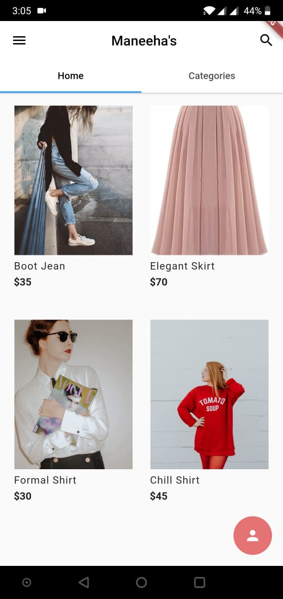
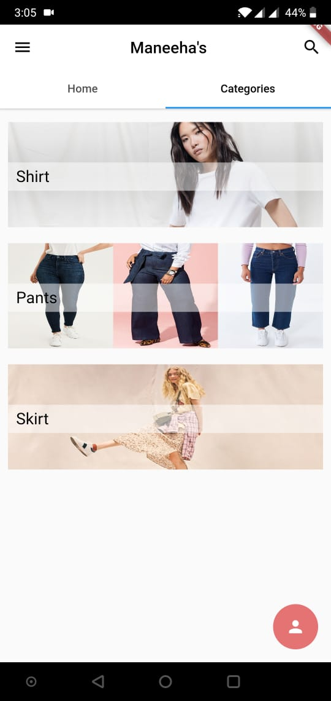
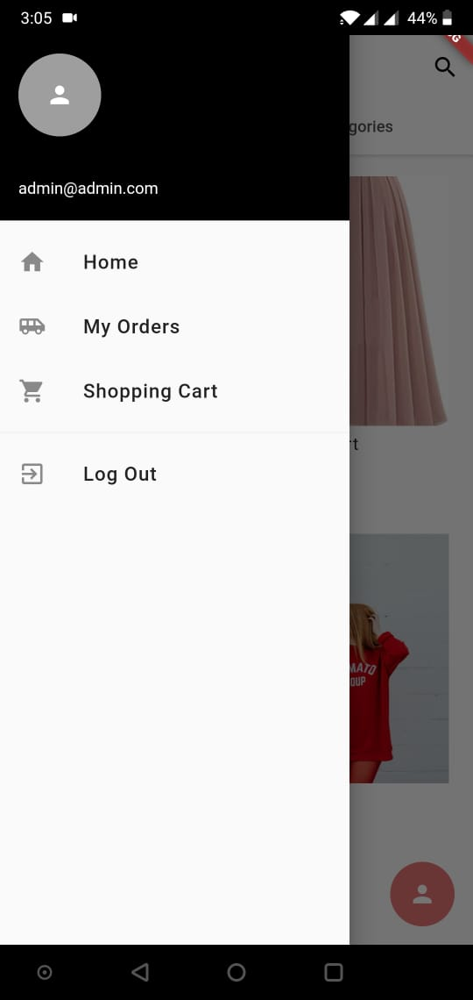

# Maneeha's

## About
This project was made for a client, Maneeha, to satisfy her E-Commerce requirements. She wanted an Android application which sells fashionable clothes. So we designed an aesthetically UI using Flutter and Firebase integration to satisfy her needs.

## Updates  
UI Updates
Use case Updates

## Use Cases
Ordering multiple products
Viewing unique products
Viewing products based on a category
Signing in / Logging out
Sigining in anonymously
Placing multiple orders at different locations
Viewing your orders
Admin can view orders
Admin can edit, add and remove products
And more!

## Screenshots  

